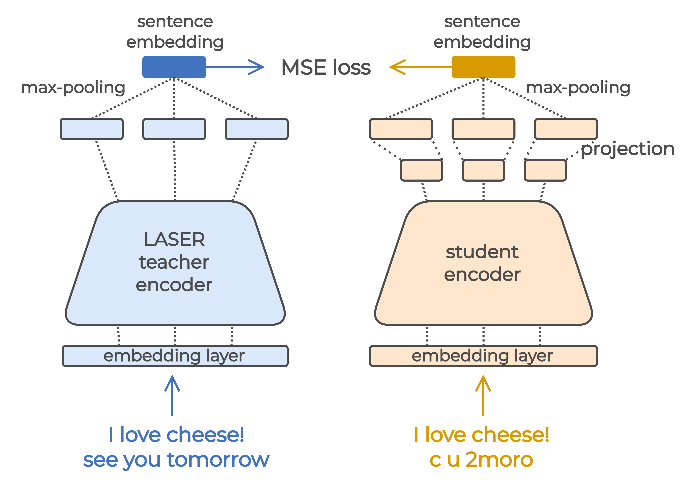

# RoLASER: A Robust LASER Encoder for English User-Generated Content

From the paper Making Sentence Embeddings Robust to User-Generated Content.

## Table of Contents

1. [Introduction](#introduction)
2. [Usage](#usage)
3. [Reproduction](#reproduction)
4. [Citation](#citation)


## 1. Introduction <a name="introduction"></a>



RoLASER is a sentence embedding model trained by distillation of LASER to be robust to user-generated content (UGC). Examples of such content are social media posts, which are known to present a lot of lexical variations (spelling errors, internet slang, abbreviations, ...). RoLASER maps non-standard UGC sentences close to their standard versions in the LASER embedding space, just as the original LASER encoder maps paraphrases and translations close to each other.

### Examples

Example cosine distance between std and ugc sentence for LASER and Rolaser

add plot of rocsmt sentences

### Results

tables?

## 2. Usage <a name="usage"></a>

### Installation

Environment:
- Python 
- Pythorch 1.10.1+cu102
- GCC

Dependencies:

- Fairseq: `git clone https://github.com/lydianish/fairseq.git`


- LASER: `git clone https://github.com/lydianish/LASER.git`

```bash
# to be able to use fairseq files
FAIRSEQ_PATH=/path/to/fairseq/
export PYTHONPATH=$PYTHONPATH:$FAIRSEQ_PATH

# to be able to use LASER files
LASER_PATH=/path/to/LASER/source/
export PYTHONPATH=$PYTHONPATH:$LASER_PATH
```

### Examples

cosine similarity of 2 sentences within python instead ?

```bash
cd RoLASER

# cosine similarity of 2 sentences
python ./evaluation/rolaser.py $sentence1 $sentence2 -m $model_path -t $tokenizer_path

## average cosine similarity and cross-lingual similarity (xSIM) of 2 files
python ./evaluation/rolaser.py $file1 $file2 -f -m $model_path -t $tokenizer_path
```

### Pre-trained models

link to download models + tokenizers?

## 3. Reproduction <a name="reproduction"></a>

link to download preprocessed data

Training
- fetch OSCAR 
- augment OSCAR
- tokenize
- fairseq preprocess
- fairseq train

Validation
- fetch flores dev
- augment flores dev
- validate
- select best checkpoint

Evaluation
- fetch flores devtest
- augment flores devtest
- evaluate
    - flores
    - multilexnorm
    - rocsmt
    - mteb
- plot sentences

## 4. Citation <a name="citation"></a>

