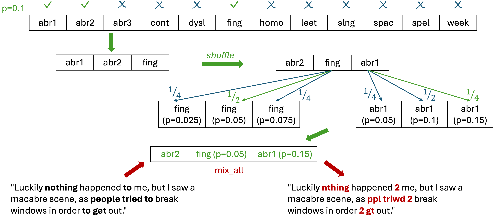

# RoLASER: A Robust LASER Encoder for English User-Generated Content

From the LREC-COLING paper [Making Sentence Embeddings Robust to User-Generated Content (Nishimwe et al., 2024)](https://aclanthology.org/2024.lrec-main.958/).

💥 Demo app on [Hugging Face Spaces](https://huggingface.co/spaces/lydianish/rolaser-demo)

💥 **News:** Release of **RoLASER v2** on [Hugging Face](https://huggingface.co/lydianish/RoLASER-v2) which is
- Compatible with SentenceTransformers
- Bilingual in English and French

## Table of Contents

1. [Introduction](#introduction)
2. [Models and data](#models)
3. [Using RoLASER](#using)
4. [Generating artificial UGC](#generating) 
5. [Citation](#citation)


## 1. Introduction <a name="introduction"></a>

<p align="center">
  
</p>
      
RoLASER is a sentence embedding model trained using a teacher-student approach (with LASER as the teacher) to be robust to English user-generated content (UGC). Examples of such content are social media posts, which are known to present a lot of lexical variations (spelling errors, internet slang, abbreviations, ...). RoLASER maps non-standard UGC sentences close to their standard versions in the LASER embedding space, just as the original LASER encoder maps paraphrases and translations close to each other.

## 2. Models and data <a name="models"></a>

### Pre-trained models

The models, tokenizers and vocabulary files for LASER, RoLASER and c-RoLASER are available for download [here](https://zenodo.org/records/10864557).

### Training, validation and evaluation data

*Coming soon...*

## 3. Using RoLASER <a name="using"></a>

### Installation

Environment:
- (Mini)conda
- Python >= 3.9 (tested with `3.9.18`)
- CUDA 10.2
- GCC 11.2
- Pythorch 1.10.1

Dependencies:
- Fairseq fork: https://github.com/lydianish/fairseq
- LASER fork: https://github.com/lydianish/LASER

Installation commands:
```bash
# Install RoLASER 
git clone https://github.com/lydianish/RoLASER.git
cd RoLASER 

# Create conda environment with the required Python and GCC versions
conda create -n "rolaser_env" python=3.9.18 gxx=11.2.0=h702ea55_10 -c conda-forge

# Activate the conda environment
conda activate rolaser_env

# Install dependencies
bash ./install.sh

# Download models
bash ./download_models.sh
```

### Example: Cosine distance between non-standard UGC sentences and their standard equivalents

#### a. Demo script

Run the demo script using this command:

```bash
bash ./demo.sh
```

It will output the pairwise cosine distances of the 4 example sentences used in the paper for LASER, RoLASER and c-RoLASER. It will write index-oriented JSON files for each model in the output directory `outputs/demo/``. 

For example, `outputs_rolaser.json`:
```json
{
    "0": {
        "ugc": "if i cnt afford the real deal , i ain\u2019t buying nuffin fake .. i just won\u2019t have it",
        "std": "if i can\u2019t afford the real deal , i ain\u2019t buying nothing fake .. i just won\u2019t have it",
        "cos": 0.0462052971
    },
    "1": {
        "ugc": "Umm idk, maybe its bc we\u2019re DIFFERENT PEOPLE with DIFFERENT BODIES???",
        "std": "Um, I don\u2019t know, maybe it\u2019s because we\u2019re different people with different bodies?",
        "cos": 0.2793171704
    },
    "2": {
        "ugc": "\" Luckily nthing happened 2 me , but I saw a macabre scene , as ppl triwd 2 break windows in order 2 gt out .",
        "std": "\"Luckily nothing happened to me, but I saw a macabre scene, as people tried to break windows in order to get out.",
        "cos": 0.009111315
    },
    "3": {
        "ugc": "I then lost interest in her bc her IG wasn't that interesting.",
        "std": "I then lost interest in her, because her Instagram wasn\u2019t that interesting.",
        "cos": 0.0059972415
    }
}
```

It will also save the following files:
- `all_scores.csv`
- `outputs.log` 
- `scores_summary.csv`
- `cosine_distance.png``

Here is the boxplot of cosine distances from the 4 example sentences:

<p align="center">
  
</p>


#### b. Computing pairwise cosine distances between sentence embeddings with Python:

An evaluation script is made available to compute the cosine distances of a file line by line (`scripts/cos_dist.py`). Use the following command to call it:

```bash
python scripts/cos_dist.py -m $MODEL \
    --ugc-file $UGC_FILE \
    --std-file $STD_FILE \
    -o $OUTPUT_DIR \
    --verbose
```

You can also modify your own Python script:

```python
import sys, os

from sklearn.metrics.pairwise import paired_cosine_distances
from sklearn.preprocessing import normalize

# Set the path to the fairseq and LASER local repos:
# Normally, the environment variables are defined during installation
# If not, you can set them here:
# os.environ['FAIRSEQ'] = '/path/to/fairseq'
# os.environ['LASER'] = '/path/to/LASER'

sys.path.append(os.environ['FAIRSEQ'])
sys.path.append(f"{os.environ['LASER']}/source")

from rolaser import RoLaserEncoder

# Set the model and vocab paths, and pick the corresponding tokenizer type 
# (spm for LASER, roberta for RoLASER, and char for c-RoLASER ):
model = "/path/to/model"
vocab = "/path/to/vocab"
tokenizer = "spm | roberta | char"

ugc_sentences = [
    "if i cnt afford the real deal , i ain’t buying nuffin fake .. i just won’t have it",
    "Umm idk, maybe its bc we’re DIFFERENT PEOPLE with DIFFERENT BODIES???",
    '" Luckily nthing happened 2 me , but I saw a macabre scene , as ppl triwd 2 break windows in order 2 gt out .',
    "I then lost interest in her bc her IG wasn't that interesting."
]

std_sentences = [
    "if i can’t afford the real deal , i ain’t buying nothing fake .. i just won’t have it",
    "Um, I don’t know, maybe it’s because we’re different people with different bodies?",
    '"Luckily nothing happened to me, but I saw a macabre scene, as people tried to break windows in order to get out.',
    "I then lost interest in her, because her Instagram wasn’t that interesting."
]

model = RoLaserEncoder(model_path=model, vocab=vocab, tokenizer=tokenizer)
    
X_std = model.encode(std_sentences)
X_std = normalize(X_std)
X_ugc = model.encode(ugc_sentences)
X_ugc = normalize(X_ugc)

X_cos = paired_cosine_distances(X_std, X_ugc)
X_cos_avg = X_cos.mean()

print('Average paired cosine distance', X_cos_avg)
```

## 4. Generating artificial UGC <a name="generating"></a>

A defining contribution of RoLASER approach is the data augmentation technique used to generate artificial real-life-like UGC by randomly selecting and applying a subset of transformations from 12 [NL-Augmenter](https://github.com/lydianish/NL-Augmenter) perturbations. 



### Installation

**Note:** Create a new Conda environment and clone the NL-Augmenter repo (outside of the RoLASER repo)!

Environment:
- (Mini)conda
- Python 3.7 (tested with `3.7.12`)
- GCC 11.2

Dependencies:
- NL-Augmenter fork: https://github.com/lydianish/NL-Augmenter.git

Installation commands:
```bash
# Go to RoLASER's parent directory
cd .. 

# Install NL-Augmenter 
git clone https://github.com/lydianish/NL-Augmenter.git
cd NL-Augmenter 
export NLAUGMENTER=`pwd` # required environment variable
echo NLAUGMENTER=$NLAUGMENTER >> ~/.bashrc

# Create conda environment with the required Python and GCC versions
conda create -n "nlaugmenter_env" python=3.7.12 gxx=11.2.0=h702ea55_10 -c conda-forge

# Activate the conda environment
conda activate nlaugmenter_env

# Install dependencies
python setup.py sdist
pip install -e .
pip install https://github.com/explosion/spacy-models/releases/download/en_core_web_sm-3.0.0/en_core_web_sm-3.0.0.tar.gz

# Return to RoLASER directory
cd ../RoLASER
```

### Usage

A data augmentation script is available at `scripts/nlaugment.py`. It is used as follows:

```bash
python scripts/nlaugment.py \
    -i $INPUT_FILE \
    --seed $SEED \
    --prob $PROB
```
where `$SEED` is the random seed and `$PROB` is the probability used to select which/how many transformations to apply to each sentence. The script creates 2 subfolders in the same directory as the input file: `trans/$SEED/` and `ugc/$SEED/`, and writes the augmented sentences and transformation applied for each sentence in two files.

### Example

For example, augment the standard demo file using:
```bash
bash demo_nlaugment.sh 
```
where the input file is `data/demo/std.txt`, the seed `0` and the proba `0.1`.
The output files are located at `data/demo/ugc/0/std_mix_all.txt` and data/`demo/trans/0/std_mix_all_trans.txt`. Here are the outputs:

|Generated sentence|Transformations|
|---|---|
|if i can’t afford the real deal , i ain’t buying nothing fake .. i just won’t have it ||
|Um, Eye Dern't Noh, maybe it's because Wiehe're differfnt people with different bodies? | abr3;homo,0.5;fing,0.025 |
|"Luckily n0thin9 happen3d to me, but I saw a macabre scene, as people tried to 6reak windows in order to g3t out.| leet,0.05 |
|I then loft ihterest in her, because her Instaggam wasn’t that inraresting. | fing,0.07500000000000001 |

## 5. Citation <a name="citation"></a>

```bibtex
@inproceedings{nishimwe-etal-2024-making-sentence,
    title = "Making Sentence Embeddings Robust to User-Generated Content",
    author = "Nishimwe, Lydia  and
      Sagot, Beno{\^\i}t  and
      Bawden, Rachel",
    editor = "Calzolari, Nicoletta  and
      Kan, Min-Yen  and
      Hoste, Veronique  and
      Lenci, Alessandro  and
      Sakti, Sakriani  and
      Xue, Nianwen",
    booktitle = "Proceedings of the 2024 Joint International Conference on Computational Linguistics, Language Resources and Evaluation (LREC-COLING 2024)",
    month = may,
    year = "2024",
    address = "Torino, Italia",
    publisher = "ELRA and ICCL",
    url = "https://aclanthology.org/2024.lrec-main.958",
    pages = "10984--10998"
}
```
